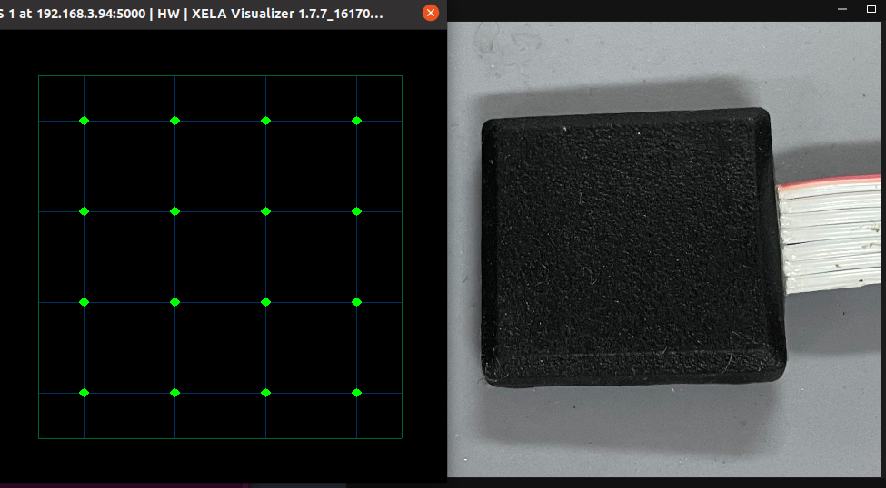

# ROS下Xela-uSkin传感器配置与启动指南

<!-- ## 一、环境准备 -->
<!-- ### 创建工作空间与功能包 -->
### 首先检查接线 先连黑色USB供电线，然后连接can的USB
复制xela官网资料里的linux相关驱动代码,命名为 xela_linx/
```bash
ls xela_linx/
LOG  slcan_activate.sh  xela_conf  xela_conf.log  xela_error.log  xela_log  xela_server  xelatools.log  xela_viz  xela_viz.log  xServ.ini
```
和CAN相关驱动 VScom_USB-CAN_Plus/
```bash
ls VScom_USB-CAN_Plus/
99-VScom_USB-CAN_Plus.rules  install.sh  README.md  remove.sh  slcan_add.sh  slcan@.service```
```
相关ROS驱动为 xela_server_ros/
```bash
ls xela_server_ros/
CMakeLists.txt  launch  LICENSE  msg  package.xml  readme.md  scripts  srv
```
## 系统为ubuntu20.04 (测试过22.04无法使用)

安装依赖(安装后才能使用slcan)
```bash
sudo apt install can-utils
```
创建/etc/xela目录 将xServ.ini复制进去
```bash
cd /etc
mkdir xela/
cp /home/galaxy/Desktop/Xela_ws/src/xela_linx/xServ.ini #修改为自己的路径
```
实际使用时xServ.ini内容如下
```bash
[CAN]
bustype = socketcan
channel = slcan0
[viz]
max_offset = 100
max_size = 100
grid = on
origins = off
arrows = off
transparency = off
[debug]
sens_print = full
[sensor]
calibration = on # 开了校准之后ROS节点才会有换算成N的数据消息
num_brd = 1
ctr_ver = 3
ctrl_id = 4
model = uSPa44
channel = 0

```
先查看USB设备名
在xela_linx/下执行slcan_activate.sh脚本 激活CAN设备

执行成功后USB-CAN设备会亮绿灯

或者配置为自动启动 在VScom_USB-CAN_Plus/目录下执行install.sh脚本 安装CAN驱动
```bash
ls /dev/ttyUSB*
/dev/ttyUSB0
sudo ./xela_linx/slcan_activate.sh 0  # 0就是USB端口号ttyUSB0
或
sudo ./VScom_USB-CAN_Plus/install.sh #一般第一次配置正常后，后续不需要每次再执行
```
在xela_linx/下执行xela_server脚本，
启动xela_server服务，启动完不能关
```bash
sudo ./xela_linx/xela_server
```
另外开一个终端执行xela_linx/中xela_viz文件
，如正常则会显示三维力可视化界面(这两条命令比较迷，有时候必须都用sudo才能正常显示，有时候又不用，但是当xela_viz必须sudo才能显示时ROS节点是连接不到xela_server的)
```bash
sudo ./xela_linx/xela_viz
```
## ROS下节点消息传输
原代码工程中src/xela_server_ros/scripts/的xela_server有问题，修改后如下：
```bash
#!/bin/bash

while true

do

params=("$@")

filtered_params=()

#printf '%s ' "${params[@]}"

# Find and remove '--ros-args' and '--params-file' from the list
while [[ " ${params[*]} " == *" --ros-args "* || " ${params[*]} " == *" --params-file "* ]]; do
    index=$(( ${#params[@]} - 1 ))
    for (( i=0; i<${#params[@]}; i++ )); do
        if [ "${params[$i]}" == "--ros-args" ]; then
            index=$i
            #printf "\nFound '--ros-args' at index ${index}"
            break
        elif [ "${params[$i]}" == "--params-file" ]; then
            index=$i
            #printf "\nFound '--params-file' at index ${index}"
            break
        fi
    done
    params=("${params[@]:0:$index}" "${params[@]:$((index+2))}")

    # Check if "--ros-args" includes "__node:=xela_server" and remove it
    if [ "${params[$index]}" == "__node:=xela_server" ]; then
        #printf "\nRemoving __node at index ${index}"
        params=("${params[@]:0:$index}" "${params[@]:$((index+1))}")
    fi
done
#printf "\n"

# Build the filtered parameters
filtered_params=("${params[@]}")

# Print the command (for debugging purposes)
# echo "Running command: xela_server ${params[@]}"

done
# Execute the command
#xela_server "${filtered_params[@]}"

```
修改好脚本文件后运行以下代码即可将传感器消息发送在ROS中（期间需要一直保持xela_server运行）
长时间运行可能发生漂移，可重新启动xela_server和ROS服务
```bash
roslaunch xela_server_ros service.launch
```
查看三维力数据话题消息
```bash
rostopic echo /xServTopic
```
一帧实际数据如下：
```bash
sensors: 
  - 
    message: 153032
    time: 1740389044.0427728
    model: "uSPa44"
    sensor_pos: 1
    taxels: 
      - 
        x: 32858
        y: 33234
        z: 39788
      - 
        x: 32661
        y: 33433
        z: 39629
      - 
        x: 32644
        y: 33548
        z: 39390
      - 
        x: 31979
        y: 33276
        z: 39970
      - 
        x: 33152
        y: 32774
        z: 39306
      - 
        x: 32834
        y: 32783
        z: 38624
      - 
        x: 32541
        y: 32651
        z: 38885
      - 
        x: 31877
        y: 32592
        z: 39237
      - 
        x: 33505
        y: 32716
        z: 39336
      - 
        x: 32721
        y: 32727
        z: 38644
      - 
        x: 32440
        y: 32841
        z: 38578
      - 
        x: 31889
        y: 32505
        z: 39097
      - 
        x: 32998
        y: 32079
        z: 39949
      - 
        x: 32437
        y: 31955
        z: 39290
      - 
        x: 32720
        y: 32147
        z: 39171
      - 
        x: 31898
        y: 31992
        z: 40205
    forces: # xela_viz 第2行第1列表示为（2,1）
      - #（1,1）
        x: -0.03092806786298752
        y: 0.0524379126727581
        z: -0.14542685449123383
      - #（1,2）
        x: -0.07722348719835281
        y: 0.049154724925756454
        z: -0.1438504010438919
      - #（1,3）
        x: -0.07646020501852036
        y: 0.06444397568702698
        z: -0.17931215465068817
      - #（1,4）
        x: -0.03594706580042839
        y: 0.032230209559202194
        z: -0.022284358739852905
      - #（2,1）
        x: -0.021287521347403526
        y: 0.04371457174420357
        z: -0.13328668475151062
      - #（2,2）
        x: -0.03526858612895012
        y: 0.03969043865799904
        z: -0.08553791791200638
      - #（2,3）
        x: -0.08842744678258896
        y: 0.04939442500472069
        z: -0.0504952073097229
      - #（2,4）
        x: -0.09700527042150497
        y: 0.04686717316508293
        z: 0.002607047325000167
      - #（3,1）
        x: -0.020337862893939018
        y: -0.015915310010313988
        z: -0.0781850814819336
      - #（3,2）
        x: -0.02280968800187111
        y: -0.04100397974252701
        z: -0.07260633260011673
      - #（3,3）
        x: -0.05311059206724167
        y: 0.003898804308846593
        z: -0.05655846744775772
      - #（3,4）
        x: -0.07227180153131485
        y: 0.03743838891386986
        z: -0.04671410471200943
      - #（4,1）
        x: -0.004585665185004473
        y: -0.010053245350718498
        z: -0.07978542894124985
      - #（4,2）
        x: -0.04271174967288971
        y: -0.016017258167266846
        z: -0.053573671728372574
      - #（4,3）
        x: 0.009421447291970253
        y: -0.00914162490516901
        z: -0.1028340756893158
      - #（4,4）
        x: -0.07343057543039322
        y: -0.0031491806730628014
        z: 0.00609383312985301

```
xela_viz与真实点位对应关系：   向左为X轴正方向 向上为Y轴正方向
 